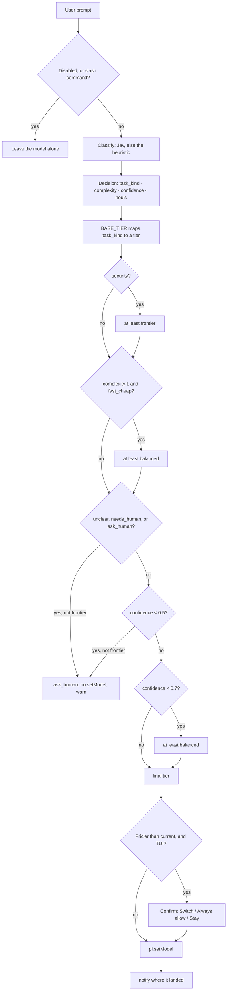

<div align="center">

# 🧭 task-router

**Per-prompt model routing for [Pi](https://github.com/earendil-works/pi-coding-agent) — pattern B.**

Classify the prompt → pick a model tier → `pi.setModel()` → tell you where it landed.

[](https://github.com/earendil-works/pi-coding-agent)

[](https://docs.typesafe.ai/api)


[](LICENSE)

</div>

Before each agent turn the router classifies the prompt, maps the classification to a model
tier, calls `pi.setModel()`, and notifies you where the prompt landed.

The classifier is **Jev** (TypeSafe's System One model). When `TYPESAFE_API_KEY` is absent, or a
Jev call fails, it degrades to a keyword heuristic and says so.

> **Scope:** no agent-gate, no per-tool routing, no Pi core changes.

---

## 📖 Table of contents

- [✨ At a glance](#-at-a-glance)
- [🔀 How it works](#-how-it-works)
- [🚀 Quick start](#-quick-start)
- [📦 Install](#-install)
- [🔧 Configuration](#-configuration)
  - [API notes for this machine](#api-notes-for-this-machine)
- [🎛 Slash commands](#-slash-commands)
- [🧠 The classifier: Jev](#-the-classifier-jev)
  - [Why `Decision.confidence` is only `task_kind`](#why-decisionconfidence-is-only-task_kind)
  - [Failure and retry behaviour](#failure-and-retry-behaviour)
- [🪫 The fallback: heuristic](#-the-fallback-heuristic)
- [📐 Policy](#-policy)
  - [`applyPolicy()`, in order](#applypolicy-in-order)
- [🛑 Confirmation gate](#-confirmation-gate)
- [🔌 On/off toggle](#-onoff-toggle)
- [✅ Verify](#-verify)
  - [The fixtures](#the-fixtures)
- [📊 Measured live](#-measured-live)
- [🎚 Tuning notes from live Jev](#-tuning-notes-from-live-jev)
- [🚨 Caveats](#-caveats)
- [🚫 Deliberately not here](#-deliberately-not-here)
- [📁 Layout](#-layout)
- [🧾 Requirements](#-requirements)
- [📄 License](#-license)

---

## ✨ At a glance

| | |
|---|---|
| 🔀 **What it does** | Switches the active model on every prompt, based on what the prompt asks for |
| 🪝 **Hook** | `before_agent_start` — fires after prompt/template expansion, before the agent loop reads the model |
| 🧠 **Classifier** | Jev / System One (`POST /v1/systemone`, four questions in one call) |
| 🪫 **Fallback** | Keyword heuristic — offline path *and* the degraded path, always announced |
| 📐 **Policy** | `policy.ts` owns the kind → tier table, thresholds, and the only place a model id appears |
| 💸 **Rotation** | Two models: `deepseek-v4-flash` (fast_cheap) and `deepseek-v4-pro` (balanced + frontier) |
| 🛑 **Gate** | TUI dialog before any switch to a *more expensive* model |
| 🔌 **Toggle** | `/task-router on \| off`, persisted to a marker file, survives `/reload` |
| 🧪 **Tests** | `node --test` · 15 tests · no key, no network, no dependencies |

---

## 🔀 How it works



Every arrow above is a function in `policy.ts` — see [Policy](#-policy) for the exact ordering rules.

---

## 🚀 Quick start

Already have the directory in place? Three commands and you are routing:

```fish
set -Ux TYPESAFE_API_KEY sk-...   # Fish. Or: export TYPESAFE_API_KEY=sk-...
```

```text
/reload          # or just start Pi — the extension is auto-discovered
/router-config    # confirm the classifier, key, and resolved tiers
```

Then send a prompt and watch the footer model move. No key? It still works — the heuristic picks
up and says so in the notify.

---

## 📦 Install

1. The directory already lives at `~/.pi/agent/extensions/task-router/`.
   Pi auto-discovers `~/.pi/agent/extensions/*/index.ts`, so no settings change is
   needed. Project-local `.pi/extensions/task-router/index.ts` also works and loads
   only after the project is trusted.
2. **Nothing to install:** the extension has no runtime dependencies. Its imports are
   `node:fs`, `node:path`, `node:url` and type-only imports from
   `@earendil-works/pi-coding-agent` (erased by jiti at load time). It talks to
   TypeSafe with plain `fetch`, not the SDK.
3. Enable Jev by exporting `TYPESAFE_API_KEY` where Pi is launched. You run Fish:

   ```fish
   set -Ux TYPESAFE_API_KEY sk-...   # universal, survives restarts
   ```

   Without it the router runs on the heuristic. `TASK_ROUTER_PROVIDER` (see below)
   controls the choice explicitly.
4. Load it: next start (auto-discovered), `/reload` (current session), or
   `pi -e ~/.pi/agent/extensions/task-router/index.ts` (throwaway).
   Keep other extensions out of the way with `--no-extensions`.

To disable: remove or rename the directory (or start with `--no-extensions`), then
`/reload`.

---

## 🔧 Configuration

| env var | default | meaning |
|---|---|---|
| `TYPESAFE_API_KEY` | unset | enables Jev; unset → heuristic only |
| `TYPESAFE_BASE_URL` | `https://api.typesafe.ai` | API root |
| `TASK_ROUTER_PROVIDER` | `auto` | `auto` = Jev if key set; `jev` = Jev, error if no key; `fake` = heuristic |
| `TASK_ROUTER_JEV_MODEL` | `jev-latest` | alias, or pin `jev-1.13.0` |
| `TASK_ROUTER_TIMEOUT_MS` | `4000` | whole call budget, retries included |
| `TASK_ROUTER_MAX_CHARS` | `4000` | prompt characters sent as `state` |

`/router-config` shows the effective classifier, masked key, thresholds, and which
model each tier resolves to *right now*.

### API notes for this machine

`~/.pi/agent/npm/node_modules` has no `@mariozechner/*` packages. The installed
agent is `@earendil-works/pi-coding-agent` **0.85.1**, and this extension is written
against it:

- `pi.setModel(model: Model<any>): Promise<boolean>` — `false` means no auth for
  that provider; the model is then left unchanged.
- `ctx.modelRegistry.find(provider, modelId)` and
  `ctx.modelRegistry.hasConfiguredAuth(model)` — used to validate every allowlist
  entry at call time, so nothing is hardcoded blindly.
- `ctx.model` — currently active model, used to skip redundant `setModel` calls.
- `before_agent_start` fires after prompt/template expansion and before the agent
  loop reads the model (`dist/core/agent-session.js:914` emits the event, then
  `_runAgentPrompt(...)` runs), so a switch inside it applies to the current turn.
- Built-in slash commands are dispatched before that hook, so `/model` is never
  routed. The guard in `index.ts` is belt-and-braces and uses a copy of
  `BUILTIN_SLASH_COMMANDS` from `dist/core/slash-commands.js` (that constant is not
  exported from the package index).

---

## 🎛 Slash commands

| command | what it does |
|---|---|
| `/router` | Last decision in this session: prompt, kind/complexity/tier, confidence, repo-map flag, provenance |
| `/router-config` | Active classifier, masked key, base URL, model, thresholds, confirm-gate state, resolved models per tier, allowlist sizes |
| `/router-check` | Run `fixtures.jsonl` through classify + `applyPolicy` — offline, no key, no LLM cost |
| `/router-check --jev` | Same fixtures against **live** Jev; asserts tier, lists kind/complexity disagreements as notes |
| `/router-check --fake` | Force the heuristic run even when the configured classifier cannot start |
| `/task-router` | Show whether routing is enabled and with which classifier |
| `/task-router on` | Re-enable routing, clear the confirm gate's "always allow" flag |
| `/task-router off` | Stop classifying and switching; the model stays wherever you leave it |
| `/model` | Never routed — built-in commands are dispatched before `before_agent_start` |

`--jev` and `--fake` are mutually exclusive.

---

## 🧠 The classifier: Jev

`POST /v1/systemone` with four questions in one call (the docs say questions are
evaluated in parallel and cost almost no extra latency):

| question | type | options |
|---|---|---|
| `task_kind` | choice | `bugfix` · `feature` · `refactor` · `tests` · `docs` · `security` · `unclear` |
| `complexity` | choice | `S` · `M` · `L` |
| `needs_repo_map` | noul | yes / no |
| `needs_human` | noul | yes / no |

The questions and option descriptions live in `providers/jev-questions.ts` — that is
the file to edit when routing is wrong, not the code around it. Thresholds live in
`policy.ts`. Both are deliberate, single, reviewable places (TypeSafe's own advice).

### Why `Decision.confidence` is only `task_kind`

- `task_kind` confidence is a strong signal: unambiguous prompts read 0.98–1.0,
  genuinely mixed ones (e.g. "add a login page" = security vs feature) read ~0.66.
- `complexity` confidence is **systematically low** (often ~0.3) because S/M/L is
  genuinely ambiguous from one line, and the choice can flip S↔M between calls.

So `Decision.confidence` is the **task_kind** confidence, not a combination of both
axes. TypeSafe's own intent-routing pattern gates on the intent answer and uses
complexity only for escalation — complexity uncertainty never vetoes a route.

### Failure and retry behaviour

- 429 / 529 retry with `retry-after` (capped at 1 s), up to three attempts.
- Any other error, or a timeout, throws; the router catches it, notifies a warning,
  and routes with the heuristic instead. A degraded turn is always visible.
- Classification is not cancellable. `before_agent_start` runs before the turn
  exists, so `ctx.signal` is `undefined` there and there is no abort to honour;
  `TASK_ROUTER_TIMEOUT_MS` is the only bound on a call.
- Responses are cached in-process by `(model, state)` — an LRU capped at 100 entries —
  so a re-sent prompt does not pay for the same judgement twice. Cache hits are
  labelled `· cached` in the provenance line.
- An unreadable answer (unknown option, missing confidence, missing noul) throws
  rather than guessing. That discards the whole classification, including a good
  `task_kind` on the same response, so the turn then routes on the heuristic
  instead of declining to route.

---

## 🪫 The fallback: heuristic

`providers/fake.ts` is keyword matching, first match wins: **security, tests, docs,
refactor, bugfix**; then explicit vagueness; then "short prompt, no signal"; then a
feature fallback. It is intentionally biased toward over-triggering `security`, the
safe direction.

It serves two roles: the **offline path** and the **fallback when Jev is
unreachable**.

---

## 📐 Policy

`policy.ts` owns the only place a model id appears, and `BASE_TIER`, the single
kind → tier table both classifiers share.

| tier | model | price rank |
|---|---|---|
| `fast_cheap` | `deepseek/deepseek-v4-flash` | 0 |
| `balanced` | `deepseek/deepseek-v4-pro` | 1 |
| `frontier` | `deepseek/deepseek-v4-pro` | 1 |

**`BASE_TIER`** — the single kind → tier table:

| task kind | base tier |
|---|---|
| `bugfix` · `tests` · `docs` | `fast_cheap` |
| `refactor` · `feature` | `balanced` |
| `security` | `frontier` |
| `unclear` | `ask_human` |

The rotation is deliberately two models: `frontier` maps to the same model as
`balanced` so the "security → at least frontier" rule still guarantees a security
prompt never lands on the flash model. To widen it later, append entries to
`TIER_MODELS` in `policy.ts`; entries that do not resolve or have no auth are
skipped at call time.

### `applyPolicy()`, in order

1. `security` → at least `frontier`
2. `complexity === "L" && tier === "fast_cheap"` → `balanced`
3. `ask_human` or `task_kind === "unclear"` or `needs_human` → `ask_human` (no `setModel`,
   warning notify) — **unless already frontier**
4. `confidence < 0.5` → `ask_human`, unless already frontier
5. `confidence < 0.7` → at least `balanced`

Frontier is terminal: a security route is never demoted to ask_human, because
ask_human does not stop the turn — it only declines to change the model.

Every id in the table exists in `pi --list-models` and has auth configured on this
machine. On another machine, replace them with ids from `pi --list-models`; missing
or unauthenticated entries are skipped, never guessed at.

---

## 🛑 Confirmation gate

Before switching to a **more expensive** model, the TUI asks. Everything else is
automatic.

- **Only in the TUI** (`ctx.mode === "tui"`). `pi -p`, `--mode json`, and RPC never
  block on a dialog.
- **Only when the target is pricier** than the current model. With the two-model
  rotation that is `deepseek-v4-flash → deepseek-v4-pro`; downgrades and no-op
  switches never prompt. A target with no `MODEL_PRICE_RANK` entry is treated as
  expensive (confirmed), so widening `TIER_MODELS` without updating the price
  table still asks rather than silently skipping the gate.
- **Dialog options:** `Switch`, `Always allow`, `Stay`. Timeout is 30 s; a timeout or
  Esc counts as `Stay` (the model does not change).
- **`Always allow`** is per session instance: it suppresses the dialog for the rest of
  this session, and resets on `/reload` or a new session.
- `/router-config` shows whether the gate is on or has been always-allowed.
- Price ordering lives in `MODEL_PRICE_RANK` in `policy.ts`, next to `TIER_MODELS`.

---

## 🔌 On/off toggle

| command | effect |
|---|---|
| `/task-router off` | Stop routing: the hook no longer classifies or switches, and the model stays wherever you leave it. Writes a `disabled` marker file in the extension directory. |
| `/task-router on` | Re-enable (deletes the marker) and reset the confirm gate's "always allow" flag. |
| `/task-router` | Show the current state. |

The marker file is the source of truth, so `off` survives `/reload` and restarts
until you turn it back on. `session_start` announces `disabled` instead of the
classifier while it is off. The `/router`, `/router-check`, and `/router-config`
commands keep working when disabled. The marker is the only entry in `.gitignore`,
so it never shows up as a repo change.

---

## ✅ Verify

**Pure mapping, no key and no network** — canned Jev responses through
`mapJevResponse`, using Node's built-in runner (Node 24 executes `.ts` directly,
no dependencies, no config). 15 tests across `policy.test.ts` and
`providers/jev.test.ts`:

```sh
node --test
```

**Offline, no key, no LLM cost** — runs the heuristic + policy over the 17 fixtures:

```text
/router-check
```

`--fake` forces that same run when the configured classifier cannot start (e.g.
`TASK_ROUTER_PROVIDER=jev` with no `TYPESAFE_API_KEY`), which is the one case
where `/router-check` otherwise refuses to run. `/router-check --jev --fake` is
rejected.

**Live Jev, real API** — asserts the **tier** per fixture and lists kind/complexity
disagreements as notes:

```text
/router-check --jev
```

**End-to-end in the TUI** (notifies are invisible in `-p`), watching the footer model:

| prompt | expect |
|---|---|
| `Fix the crash when saving a draft` | `routed: bugfix/S -> fast_cheap -> deepseek/deepseek-v4-flash` |
| `Refactor the billing context into smaller modules` | `routed: refactor/M -> balanced -> deepseek/deepseek-v4-pro` |
| `There's an IDOR in the orders endpoint - users can read other people's orders` | `routed: security/L -> frontier -> deepseek/deepseek-v4-pro` |
| `do it` | warning, `ask_human`, footer unchanged |

Then: `/router` (last decision + provenance), `/router-config` (classifier,
thresholds, resolved tiers), `/model` (must not be re-routed).

**Step 0** (isolate `setModel` from classification): set `STEP0_PROOF = true` in
`index.ts`, `/reload`, send anything, watch the footer move to `deepseek-v4-flash`;
set back to `false`, `/reload`.

### The fixtures

`fixtures.jsonl` holds 17 expected-kind / expected-complexity / expected-tier cases:

| expected tier | count |
|---|---|
| `fast_cheap` | 5 |
| `balanced` | 4 |
| `frontier` | 4 |
| `ask_human` | 4 |

| expected kind | count |
|---|---|
| `security` | 4 |
| `unclear` | 4 |
| `bugfix` · `refactor` · `tests` · `docs` | 2 each |
| `feature` | 1 |

---

## 📊 Measured live

On this machine (`jev-1.13.0`):

| metric | value |
|---|---|
| Classification latency | ~**1.4 s** per prompt |
| Input tokens | ~**915** per classification |
| Cost | ~**$0.00004** at $42/Btok (output is free) |
| `task_kind` confidence, unambiguous | 0.98 – 1.0 |
| `task_kind` confidence, mixed | ~0.66 |
| `complexity` confidence | ~0.3 (systematically low — see above) |
| `/router-check --jev` | **16/17** |

---

## 🎚 Tuning notes from live Jev

- "Fix the 500 error in the login handler" reads as **bugfix** (0.92), not security.
  Jev is right: a 500 is a bug, the word "login" is just where it happened. Use a
  genuine vuln phrase (`IDOR`, `XSS`, `SQL injection`) to exercise the security path.
- "Add a login page to the admin dashboard" reads as security 0.71 / feature 0.29 —
  the security-first policy sends it to frontier. Over-triggering security is the
  intended bias; if that is too aggressive, tighten `TASK_KIND_CRITERIA.security` in
  `providers/jev-questions.ts` rather than raising thresholds.
- Complexity is a weak signal; the router only uses it for the S/M/L bump and never
  gates on its confidence. If a prompt keeps landing on the wrong S/M/L, that is
  mostly cosmetic (it rarely changes the tier).
- `needs_human` is a **safety veto**, not an ambiguity check: destructive or
  irreversible operations, or decisions that are not the agent's to make.
  Ambiguity is `unclear`'s job. A prompt whose *symptom* says "delete" but whose
  task is "fix the permission check" still routes to frontier — needs_human fires,
  but frontier is terminal.
- `/router-check --jev` is 16/17 on this machine. The one tier miss,
  "Improve error handling in the parser", is Jev hedging (kind confidence 0.65)
  and the confidence floor lifting it to balanced — the floor doing its job, not a
  defect. The keyword fallback calls it bugfix/fast_cheap.

---

## 🚨 Caveats

- ~1.4 s of classification latency is added to every prompt. `TASK_ROUTER_PROVIDER=fake`
  removes it at the cost of heuristic-only routing.
- Switching providers mid-conversation can invalidate provider-specific reasoning
  blocks in history. If a turn errors after a switch, start a new session or pin a
  model with `/model`.
- Per-prompt switching defeats prompt caching across turns.
- Each switch emits `model_select`, so `model-status.ts`-style extensions notify too,
  and thinking level can be clamped to the new model's capabilities.
- `--models` / `enabledModels` scoping affects Ctrl+P cycling, not `setModel`; the
  router can pick a model outside the scoped set if the tier says so.
- A manual `/model` choice survives until your next prompt, then the router re-routes.
  Inherent to pattern B.

---

## 🚫 Deliberately not here

Per-tool routing, an agent-gate, an HTTP service of our own, and changes to Pi core.
Jev is called only from `before_agent_start`, once per prompt.

---

## 📁 Layout

```text
~/.pi/agent/extensions/task-router/
  index.ts                    extension entry: before_agent_start hook + /router, /router-check, /router-config, /task-router
  schema.ts                   task_kind / complexity / model_tier types; the Decision contract
  policy.ts                   TIER_MODELS, MODEL_PRICE_RANK, BASE_TIER, thresholds, applyPolicy, resolveTierModel
  policy.test.ts              price-rank and confirm-gate tests
  fixtures.jsonl              17 expected-kind / complexity / tier cases
  README.md
  LICENSE                     MIT
  .gitignore                  the `disabled` marker
  providers/
    types.ts                  ClassifierProvider seam
    jev.ts                    HTTP client, response mapping, retries, LRU cache
    jev-questions.ts          the questions sent to Jev  (REVIEW THIS)
    jev.test.ts               canned-response tests for the mapping
    fake.ts                   keyword heuristic + the fallback provider
```

---

## 🧾 Requirements

| requirement | why |
|---|---|
| `@earendil-works/pi-coding-agent` **0.85.1** (or compatible) | The extension is written against this build's `setModel`, `modelRegistry`, and `before_agent_start` semantics |
| **Node ≥ 24** | Only to run `node --test` — Node 24 executes `.ts` directly, so the tests need no toolchain |
| `TYPESAFE_API_KEY` | Optional. Without it the heuristic routes, and every degraded turn says so |
| A model that exists in `pi --list-models` with auth | Each tier's allowlist is validated at call time; unresolvable entries are skipped |

---

## 📄 License

MIT — see [LICENSE](LICENSE).

```text
Copyright (c) 2026 Riza Fahmi
```
