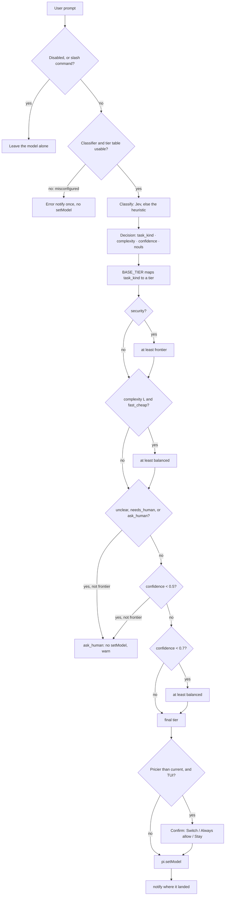

<div align="center">

# 🧭 task-router

**Per-prompt model routing for [Pi](https://github.com/earendil-works/pi-coding-agent) — pattern B.**

Classify the prompt → pick a model tier → `pi.setModel()` → tell you where it landed.

Package `pi-jev-task-router` — `pi install git:github.com/rizafahmi/pi-jev-task-router@v0.1.1`

[](https://github.com/earendil-works/pi-coding-agent)

[](https://docs.typesafe.ai/api)


[](https://github.com/rizafahmi/pi-jev-task-router/actions/workflows/ci.yml)


[](LICENSE)

</div>

Before each agent turn the router classifies the prompt, maps the classification to a model
tier, calls `pi.setModel()`, and notifies you where the prompt landed.

The classifier is **Jev** (TypeSafe's System One model). When `TYPESAFE_API_KEY` is absent, or a
Jev call fails, it degrades to a keyword heuristic and says so.

> **Scope:** no agent-gate, no per-tool routing, no Pi core changes.

---

## 📖 Table of contents

- [✨ At a glance](#-at-a-glance)
- [🔀 How it works](#-how-it-works)
- [🚀 Quick start](#-quick-start)
- [📦 Install](#-install)
- [🔧 Configuration](#-configuration)
  - [Where a missing key is reported](#where-a-missing-key-is-reported)
  - [Tier models](#tier-models)
- [🎛 Slash commands](#-slash-commands)
- [🧠 The classifier: Jev](#-the-classifier-jev)
  - [Why `Decision.confidence` is only `task_kind`](#why-decisionconfidence-is-only-task_kind)
  - [Failure and retry behaviour](#failure-and-retry-behaviour)
- [🪫 The fallback: heuristic](#-the-fallback-heuristic)
- [📐 Policy](#-policy)
  - [`applyPolicy()`, in order](#applypolicy-in-order)
- [🛑 Confirmation gate](#-confirmation-gate)
- [🔌 On/off toggle](#-onoff-toggle)
- [✅ Verify](#-verify)
  - [The fixtures](#the-fixtures)
- [📊 Measured live](#-measured-live)
- [🎚 Tuning notes from live Jev](#-tuning-notes-from-live-jev)
- [🚨 Caveats](#-caveats)
- [🚫 Deliberately not here](#-deliberately-not-here)
- [📁 Layout](#-layout)
- [🧾 Requirements](#-requirements)
- [🤝 Contributing](CONTRIBUTING.md)
- [📄 License](#-license)

---

## ✨ At a glance

| | |
|---|---|
| 🔀 **What it does** | Switches the active model on every prompt, based on what the prompt asks for |
| 🪝 **Hook** | `before_agent_start` — fires after prompt/template expansion, before the agent loop reads the model |
| 🧠 **Classifier** | Jev / System One (`POST /v1/systemone`, four questions in one call) |
| 🪫 **Fallback** | Keyword heuristic — offline path *and* the degraded path, always announced |
| 📐 **Policy** | `policy.ts` owns the kind → tier table, the thresholds, and the default model ids (overridable with `TASK_ROUTER_TIERS`) |
| 💸 **Rotation** | Default two-model rotation: `deepseek-v4-flash` (fast_cheap) and `deepseek-v4-pro` (balanced + frontier) — override with `TASK_ROUTER_TIERS` |
| 🛑 **Gate** | TUI dialog before any switch to a *more expensive* model |
| 🔌 **Toggle** | `/task-router on \| off`, persisted to a marker file, survives `/reload`. The router also turns itself off when Jev rejects the API key |
| 🧪 **Tests** | `node --test` · 30 tests · no key, no network, and no install needed to run them |

---

## 🔀 How it works



The policy arrows above are functions in `policy.ts` — see [Policy](#-policy) for the exact
ordering rules. The guards, the confirmation gate and `setModel` live in `index.ts`.

---

## 🚀 Quick start

```sh
pi install git:github.com/rizafahmi/pi-jev-task-router@v0.1.1   # 1. install
export TYPESAFE_API_KEY=sk-...                                  # 2. optional, enables Jev
```

```text
/reload           # or just start Pi — installed packages load on startup
/router-config    # confirm the classifier, the key, and what each tier resolves to
```

Then send a prompt and watch the footer model move. No API key? The keyword heuristic routes
instead and says so in the notify. No model switch at all? Read this box first.

> ### ⚠️ First run: the shipped tier models are one machine's catalogue
>
> The default tier → model allowlist is `deepseek/deepseek-v4-flash` (fast_cheap) and
> `deepseek/deepseek-v4-pro` (balanced, frontier). Those ids exist on the machine this was
> built on; on yours they may not. When a tier cannot resolve, the router does **not** switch
> and notifies `router: no usable model for <tier> - check the tier table ...` on every prompt.
>
> `/router-config` shows the answer — the line to look for is
> `resolved now: fast_cheap=… · balanced=… · frontier=…`. `UNRESOLVED` means that tier has no
> model in your catalogue with auth configured. Fix it without touching the code:
>
> ```sh
> export TASK_ROUTER_TIERS='{"fast_cheap":["provider/small-model"],"balanced":["provider/mid-model"],"frontier":["provider/big-model"]}'
> ```
>
> Tiers you omit keep their default. Ids are never invented: an entry that is not in
> `pi --list-models`, or has no auth, is skipped. Full rules in [Tier models](#tier-models).

---

## 📦 Install

### As a Pi package (recommended)

```sh
pi install git:github.com/rizafahmi/pi-jev-task-router@v0.1.1
```

`pi install` clones the package to
`~/.pi/agent/git/github.com/rizafahmi/pi-jev-task-router`, records it in
`~/.pi/agent/settings.json`, and loads it on every start. `pi list` shows installed packages;
`pi remove git:github.com/rizafahmi/pi-jev-task-router` removes it. Drop the `@ref` to follow
the default branch, or add `-l` to install project-locally into `.pi/settings.json`.

### As a plain clone

Pi also auto-discovers `~/.pi/agent/extensions/*/index.ts`, so a checkout works with no
manifest at all:

```sh
git clone https://github.com/rizafahmi/pi-jev-task-router ~/.pi/agent/extensions/pi-jev-task-router
```

Project-local `.pi/extensions/pi-jev-task-router/index.ts` works too and loads only after the
project is trusted.

### Nothing else to install

The extension has **no runtime dependencies**. Its imports are `node:fs`, `node:os`,
`node:path`, `node:url` and type-only imports from `@earendil-works/pi-coding-agent` (erased at
load time). It talks to TypeSafe with plain `fetch`, not the SDK. Whichever install route you
use, load it with a restart, `/reload`, or a throwaway run:

```sh
pi -e git:github.com/rizafahmi/pi-jev-task-router          # try the package, do not install
pi -e ~/.pi/agent/extensions/pi-jev-task-router/index.ts  # run a checkout directly
```

### Enable the classifier (optional)

Export `TYPESAFE_API_KEY` where Pi is launched. Without it the router runs on the keyword
heuristic and says so; `TASK_ROUTER_PROVIDER` (below) controls the choice explicitly.

```sh
export TYPESAFE_API_KEY=sk-...     # sh, bash, zsh
```

```fish
set -Ux TYPESAFE_API_KEY sk-...    # fish, universal: survives restarts
```

Each *route* now leaves a footer marker and a notify. Keep other extensions out of the way
with `--no-extensions`.

### Disable / uninstall

`/task-router off` stops routing but keeps the extension loaded (see
[On/off toggle](#-onoff-toggle)); `pi remove git:github.com/rizafahmi/pi-jev-task-router`
uninstalls it.

---

## 🔧 Configuration

| env var | default | meaning |
|---|---|---|
| `TYPESAFE_API_KEY` | unset | enables Jev. Unset **or blank** → heuristic only; with `TASK_ROUTER_PROVIDER=jev` its absence is an error |
| `TYPESAFE_BASE_URL` | `https://api.typesafe.ai` | API root |
| `TASK_ROUTER_PROVIDER` | `auto` | `auto` = Jev if key set; `jev` = Jev, error if no key; `fake` = heuristic |
| `TASK_ROUTER_JEV_MODEL` | `jev-1.13.0` | pinned; set `jev-latest` to follow the alias |
| `TASK_ROUTER_TIMEOUT_MS` | `4000` | whole call budget, retries included |
| `TASK_ROUTER_MAX_CHARS` | `4000` | prompt characters sent as `state` |
| `TASK_ROUTER_TIERS` | unset (uses `policy.ts`) | JSON override for the tier → model allowlist — see [Tier models](#tier-models) |

`/router-config` shows the effective classifier, masked key, thresholds, and which
model each tier resolves to *right now*.

### Where a missing key is reported

The key is read once, when the extension loads, and a blank value counts as missing. Getting
it wrong is never silent:

| situation | what you see |
|---|---|
| no key, `TASK_ROUTER_PROVIDER=auto` | Session start says `heuristic (TYPESAFE_API_KEY is unset)`. Routing still works, on the heuristic |
| no key, `TASK_ROUTER_PROVIDER=jev` | Misconfiguration: the router refuses to route, the footer shows `inert - see /router-config`, and the first prompt notifies an error |
| a blank value (`TYPESAFE_API_KEY= `) | Treated as missing, not as a bad key — no wasted API call |
| the key is set but **rejected** (HTTP 401/403) | **Routing turns itself off**, the same as `/task-router off`: `router: jev rejected the API key (HTTP 403) - fix TYPESAFE_API_KEY, then /task-router on to re-enable`. The footer shows `off (jev key rejected)`. Deliberately no heuristic fallback — the key is set, so Jev is what you asked for |
| a transient failure (5xx, timeout, retries exhausted) | That turn warns `jev unavailable, using heuristics - <reason>` and routes on the heuristic. Assumed recoverable, so it tries again next prompt instead of disabling |

The rejected-key case is the one that changes state, and it is deliberate: the key is read once
at load, so a key the API refuses will not start working mid-session. Rather than pay a round
trip and print a warning on every prompt — or quietly route on keywords when you configured a
classifier — the router stops and tells you how to resume. The reason is written **into** the
marker file, so a `/reload` or a later session still explains why it is off instead of showing a
bare `disabled`.

`/router-config` (masked key + resolved classifier) and `/task-router` (enabled, with which
classifier) answer the question at any time, whether or not you saw the startup line. Only the
session-start line and the confirm dialogs need a UI: in `pi -p` and `--mode json` pi discards
extension notifications, so when the router is inert there it writes the same line to **stderr**
instead.

Setting the variable is up to you and your environment — a shell profile, a wrapper script, a
secret manager, a container env. The extension only reads it.

### Tier models

A **tier** (`fast_cheap` · `balanced` · `frontier`) is what the policy reasons about; a
**model id** is what `pi` can actually load. `policy.ts` holds the default mapping — and it is
**an example taken from one model catalogue**, not a recommendation, so point it at models you
actually have before trusting a route:

| tier | default model | price rank |
|---|---|---|
| `fast_cheap` | `deepseek/deepseek-v4-flash` | 0 |
| `balanced` | `deepseek/deepseek-v4-pro` | 1 |
| `frontier` | `deepseek/deepseek-v4-pro` | 1 |

Those defaults are **an example from one catalogue**, not a recommendation. Override them
without editing code by setting `TASK_ROUTER_TIERS` — a JSON object, partially or fully
specified, omitted tiers keep their default:

```sh
export TASK_ROUTER_TIERS='{"fast_cheap":["anthropic/claude-haiku-4-5"],"balanced":["anthropic/claude-sonnet-4-5"],"frontier":["anthropic/claude-opus-4-1"]}'
```

Rules, all enforced at load time with one actionable error:

- each entry is `"provider/modelId"`; only the **first** slash splits, so
  `openrouter/meta-llama/llama-3-70b` is provider `openrouter`, model
  `meta-llama/llama-3-70b`;
- an unknown tier key, a non-array value, an empty array, a non-string entry, or a string
  without a `provider/` prefix is rejected — `TASK_ROUTER_TIERS` is too easy to typo to fail
  silently. The router then refuses to route and says which key is wrong, and
  `/router-config` prints `tier table: UNUSABLE`.
- entries are **ordered allowlists**: the first one that exists in your catalogue *and* has
  auth configured wins. Entries that do not resolve are skipped, never guessed at — this is
  also why a typo is loud rather than a silent downgrade.
- a tier that resolves to nothing at all leaves the model untouched and notifies
  `no usable model for <tier>`.

The rotation here is deliberately two models, with `frontier` mapping to the same model as
`balanced`. That is not an accident: "security → at least frontier" is what guarantees a
security prompt never lands on the flash model, and the tier distinction still drives the
confirm gate and the footer, even when the model behind two tiers is the same.

Regardless of the tier, **`TASK_ROUTER_TIERS` never affects price ordering**:
`MODEL_PRICE_RANK` in `policy.ts` decides whether a switch is "more expensive". A model it has
no entry for is treated as expensive, so the confirmation gate fails closed rather than
guessing.

---

## 🎛 Slash commands

| command | what it does |
|---|---|
| `/router` | Last decision in this session: prompt, kind/complexity/tier, confidence, repo-map flag, provenance |
| `/router-config` | Active classifier, masked key, base URL, model, thresholds, confirm-gate state, marker path and why it is off, tier table origin, resolved models per tier, effective allowlists |
| `/router-check` | Run `fixtures.jsonl` through classify + `applyPolicy` — offline, no key, no LLM cost |
| `/router-check --jev` | Same fixtures against **live** Jev; asserts tier, lists kind/complexity disagreements as notes |
| `/router-check --fake` | Force the heuristic run even when the configured classifier cannot start |
| `/task-router` | Show whether routing is enabled and with which classifier |
| `/task-router on` | Re-enable routing, clear the confirm gate's "always allow" flag |
| `/task-router off` | Stop classifying and switching; the model stays wherever you leave it |
| `/model` | Never routed — built-in commands are dispatched before `before_agent_start` |

`--jev` and `--fake` are mutually exclusive.

---

## 🧠 The classifier: Jev

`POST /v1/systemone` with four questions in one call (the docs say questions are
evaluated in parallel and cost almost no extra latency):

| question | type | options |
|---|---|---|
| `task_kind` | choice | `bugfix` · `feature` · `refactor` · `tests` · `docs` · `security` · `unclear` |
| `complexity` | choice | `S` · `M` · `L` |
| `needs_repo_map` | noul | yes / no |
| `needs_human` | noul | yes / no |

The questions and option descriptions live in `providers/jev-questions.ts` — that is
the file to edit when routing is wrong, not the code around it. Thresholds live in
`policy.ts`. Both are deliberate, single, reviewable places (TypeSafe's own advice).

### Why `Decision.confidence` is only `task_kind`

- `task_kind` confidence is a strong signal: unambiguous prompts read 0.98–1.0,
  genuinely mixed ones (e.g. "add a login page" = security vs feature) read ~0.66.
- `complexity` confidence is **systematically low** (often ~0.3) because S/M/L is
  genuinely ambiguous from one line, and the choice can flip S↔M between calls.

So `Decision.confidence` is the **task_kind** confidence, not a combination of both
axes. TypeSafe's own intent-routing pattern gates on the intent answer and uses
complexity only for escalation — complexity uncertainty never vetoes a route.

### Failure and retry behaviour

- 429 / 529 retry with `retry-after` (capped at 1 s), up to three attempts.
- **401 / 403 do not retry, and do not fall back.** The key is rejected, so the router turns
  itself off with the reason in the marker file — see
  [Where a missing key is reported](#where-a-missing-key-is-reported). No heuristic route for
  that turn: a set key means Jev is what you asked for.
- Any other error, or a timeout, throws; the router catches it, notifies a warning,
  and routes with the heuristic instead. A degraded turn is always visible.
- Classification is not cancellable. `before_agent_start` runs before the turn
  exists, so `ctx.signal` is `undefined` there and there is no abort to honour;
  `TASK_ROUTER_TIMEOUT_MS` is the only bound on a call.
- Responses are cached in-process by `(model, state)` — an LRU capped at 100 entries —
  so a re-sent prompt does not pay for the same judgement twice. Cache hits are
  labelled `· cached` in the provenance line.
- An unreadable answer (unknown option, missing confidence, missing noul) throws
  rather than guessing. That discards the whole classification, including a good
  `task_kind` on the same response, so the turn then routes on the heuristic
  instead of declining to route.

---

## 🪫 The fallback: heuristic

`providers/fake.ts` is keyword matching, first match wins: **security, tests, docs,
refactor, bugfix**; then explicit vagueness; then "short prompt, no signal"; then a
feature fallback. It is intentionally biased toward over-triggering `security`, the
safe direction.

It serves two roles: the **offline path** and the **fallback when Jev is
unreachable**.

---

## 📐 Policy

`policy.ts` owns `BASE_TIER`, the single kind → tier table both classifiers share, and the
thresholds. Model ids live there only as defaults — see [Tier models](#tier-models) for the
allowlist and how to override it.

**`BASE_TIER`** — the single kind → tier table:

| task kind | base tier |
|---|---|
| `bugfix` · `tests` · `docs` | `fast_cheap` |
| `refactor` · `feature` | `balanced` |
| `security` | `frontier` |
| `unclear` | `ask_human` |

### `applyPolicy()`, in order

1. `security` → at least `frontier`
2. `complexity === "L" && tier === "fast_cheap"` → `balanced`
3. `ask_human` or `task_kind === "unclear"` or `needs_human` → `ask_human` (no `setModel`,
   warning notify) — **unless already frontier**
4. `confidence < 0.5` → `ask_human`, unless already frontier
5. `confidence < 0.7` → at least `balanced`

Frontier is terminal: a security route is never demoted to ask_human, because
ask_human does not stop the turn — it only declines to change the model.

The three floors are the knobs you actually tune, alongside the questions in
`providers/jev-questions.ts`. Everything above is one pure function over a `Decision`, which
is why the policy is testable without a key, a network, or a model registry.

---

## 🛑 Confirmation gate

Before switching to a **more expensive** model, the TUI asks. Everything else is
automatic.

- **Only in the TUI** (`ctx.mode === "tui"`). `pi -p`, `--mode json`, and RPC never
  block on a dialog.
- **Only when the target is pricier** than the current model. With the two-model
  rotation that is `deepseek-v4-flash → deepseek-v4-pro`; downgrades and no-op
  switches never prompt. A target with no `MODEL_PRICE_RANK` entry is treated as
  expensive (confirmed), so widening the rotation (`TIER_MODELS` or `TASK_ROUTER_TIERS`)
  without adding the matching price entry still asks rather than silently skipping the gate.
- **Dialog options:** `Switch`, `Always allow`, `Stay`. Timeout is 30 s; a timeout or
  Esc counts as `Stay` (the model does not change).
- **`Always allow`** is per session instance: it suppresses the dialog for the rest of
  this session, and resets on `/reload` or a new session.
- `/router-config` shows whether the gate is on or has been always-allowed.
- Price ordering lives in `MODEL_PRICE_RANK` in `policy.ts`, next to `TIER_MODELS`.

---

## 🔌 On/off toggle

| command | effect |
|---|---|
| `/task-router off` | Stop routing: the hook no longer classifies or switches, and the model stays wherever you leave it. Writes the marker file into Pi's agent dir. |
| `/task-router on` | Re-enable (deletes the marker) and reset the confirm gate's "always allow" flag. |
| `/task-router` | Show the current state. |

The marker file is the source of truth, so `off` survives `/reload` and restarts
until you turn it back on. `session_start` announces `disabled` instead of the
classifier while it is off. The `/router`, `/router-check`, and `/router-config`
commands keep working when disabled.

It lives at `~/.pi/agent/pi-jev-task-router.disabled` (`$PI_CODING_AGENT_DIR` is
honoured), **not** in the package directory — installed packages are managed by Pi, and a
git package is reset and cleaned when its pinned ref changes, so a marker written inside it
would silently disappear on `pi update --extensions`. If the file cannot be written, the
toggle reports the error instead of throwing.

The router also turns **itself** off when Jev rejects the API key — writing the same marker, with
the reason as its content, so `/reload` and later sessions still say why. That is the only
automatic `off`: everything else degrades to the heuristic. `/task-router on` is always the way
back.

---

## ✅ Verify

**Pure mapping, no key and no network** — canned Jev responses through
`mapJevResponse`, using Node's built-in runner (`.ts` runs directly from Node 22.18,
no toolchain, no `npm install`). 30 tests across `policy.test.ts` and
`providers/jev.test.ts`:

```sh
node --test          # or: npm test
```

**Types** — the same pure modules are type-checked in CI. `typescript`, `@types/node` and the
Pi types are devDependencies, and Pi installs packages with `--omit=dev`, so none of it
reaches a user:

```sh
npm install && npm run typecheck
```

**Offline, no key, no LLM cost** — runs the heuristic + policy over the 17 fixtures:

```text
/router-check
```

`--fake` forces that same run when the configured classifier cannot start (e.g.
`TASK_ROUTER_PROVIDER=jev` with no `TYPESAFE_API_KEY`), which is the one case
where `/router-check` otherwise refuses to run. `/router-check --jev --fake` is
rejected.

**Live Jev, real API** — asserts the **tier** per fixture and lists kind/complexity
disagreements as notes:

```text
/router-check --jev
```

**End-to-end in the TUI** (notifies are invisible in `-p`), watching the footer model. The
right-hand column assumes the **default** tier table — with `TASK_ROUTER_TIERS` set, expect
your own ids in the same tiers:

| prompt | expect |
|---|---|
| `Fix the crash when saving a draft` | `routed: bugfix/S -> fast_cheap -> deepseek/deepseek-v4-flash` |
| `Refactor the billing context into smaller modules` | `routed: refactor/M -> balanced -> deepseek/deepseek-v4-pro` |
| `There's an IDOR in the orders endpoint - users can read other people's orders` | `routed: security/L -> frontier -> deepseek/deepseek-v4-pro` |
| `do it` | warning, `ask_human`, footer unchanged |

Then: `/router` (last decision + provenance), `/router-config` (classifier,
thresholds, resolved tiers), `/model` (must not be re-routed).

**Step 0** (isolate `setModel` from classification): set `STEP0_PROOF = true` in
`index.ts`, `/reload`, send anything, watch the footer move to `deepseek-v4-flash`;
set back to `false`, `/reload`.

### The fixtures

`fixtures.jsonl` holds 17 expected-kind / expected-complexity / expected-tier cases:

| expected tier | count |
|---|---|
| `fast_cheap` | 5 |
| `balanced` | 4 |
| `frontier` | 4 |
| `ask_human` | 4 |

| expected kind | count |
|---|---|
| `security` | 4 |
| `unclear` | 4 |
| `bugfix` · `refactor` · `tests` · `docs` | 2 each |
| `feature` | 1 |

---

## 📊 Measured live

Measured on one machine, against `jev-1.13.0` — which is the shipped default precisely so
these numbers stay attached to a version — on 2026-09-19. Reproduce with
`/router-check --jev`:

| metric | value |
|---|---|
| Classification latency | ~**1.4 s** per prompt |
| Input tokens | ~**915** per classification |
| Cost | ~**$0.00004** at $42/Btok (output is free) |
| `task_kind` confidence, unambiguous | 0.98 – 1.0 |
| `task_kind` confidence, mixed | ~0.66 |
| `complexity` confidence | ~0.3 (systematically low — see above) |
| `/router-check --jev` | **16/17** |

---

## 🎚 Tuning notes from live Jev

- "Fix the 500 error in the login handler" reads as **bugfix** (0.92), not security.
  Jev is right: a 500 is a bug, the word "login" is just where it happened. Use a
  genuine vuln phrase (`IDOR`, `XSS`, `SQL injection`) to exercise the security path.
- "Add a login page to the admin dashboard" reads as security 0.71 / feature 0.29 —
  the security-first policy sends it to frontier. Over-triggering security is the
  intended bias; if that is too aggressive, tighten `TASK_KIND_CRITERIA.security` in
  `providers/jev-questions.ts` rather than raising thresholds.
- Complexity is a weak signal; the router only uses it for the S/M/L bump and never
  gates on its confidence. If a prompt keeps landing on the wrong S/M/L, that is
  mostly cosmetic (it rarely changes the tier).
- `needs_human` is a **safety veto**, not an ambiguity check: destructive or
  irreversible operations, or decisions that are not the agent's to make.
  Ambiguity is `unclear`'s job. A prompt whose *symptom* says "delete" but whose
  task is "fix the permission check" still routes to frontier — needs_human fires,
  but frontier is terminal.
- `/router-check --jev` scores 16/17 with `jev-1.13.0` on the machine these fixtures were
  written from; your number may differ, which is the point of running it. The one tier miss,
  "Improve error handling in the parser", is Jev hedging (kind confidence 0.65)
  and the confidence floor lifting it to balanced — the floor doing its job, not a
  defect. The keyword fallback calls it bugfix/fast_cheap.

---

## 🚨 Caveats

- ~1.4 s of classification latency is added to every prompt. `TASK_ROUTER_PROVIDER=fake`
  removes it at the cost of heuristic-only routing.
- Switching providers mid-conversation can invalidate provider-specific reasoning
  blocks in history. If a turn errors after a switch, start a new session or pin a
  model with `/model`.
- Per-prompt switching defeats prompt caching across turns.
- Each switch emits `model_select`, so `model-status.ts`-style extensions notify too,
  and thinking level can be clamped to the new model's capabilities.
- `--models` / `enabledModels` scoping affects Ctrl+P cycling, not `setModel`; the
  router can pick a model outside the scoped set if the tier says so.
- A manual `/model` choice survives until your next prompt, then the router re-routes.
  Inherent to pattern B.
- `TYPESAFE_API_KEY` comes from the environment, so it is inherited by everything Pi
  spawns — including the commands the model runs through the `bash` tool, where `env`
  shows it. Pass it per-process if that matters to you.

---

## 🚫 Deliberately not here

Per-tool routing, an agent-gate, an HTTP service of our own, and changes to Pi core.
Jev is called only from `before_agent_start`, once per prompt.

---

## 📁 Layout

```text
task-router/                    (installed as pi-jev-task-router)
  package.json                  pi package manifest: pi.extensions -> ./index.ts, test + typecheck scripts
  tsconfig.json                 typecheck config (noEmit; dev-only)
  index.ts                      extension entry: before_agent_start hook + /router, /router-check, /router-config, /task-router
  schema.ts                     task_kind / complexity / model_tier types; the Decision contract
  policy.ts                     BASE_TIER, thresholds, applyPolicy, resolveTierModel,
                                TIER_MODELS + MODEL_PRICE_RANK (the defaults), parseTierModels
  policy.test.ts                price-rank, confirm-gate and TASK_ROUTER_TIERS tests
  fixtures.jsonl                17 expected-kind / complexity / tier cases
  README.md
  CONTRIBUTING.md               dev loop, where the knobs are, notes on the Pi extension API
  LICENSE                       MIT
  .gitignore
  scripts/
    vanilla-check.sh            install this like a stranger would, then assert it loaded once
    check-commands.mjs          RPC assertion: the four commands, once each, origin=package
  .github/
    workflows/ci.yml            node --test + tsc --noEmit, plus a package-load check
    workflows/package-check.yml on a tag push: install git:…@tag and verify the clone
    ISSUE_TEMPLATE/bug_report.md
  providers/
    types.ts                    ClassifierProvider seam
    jev.ts                      HTTP client, response mapping, retries, LRU cache
    jev-questions.ts            the questions sent to Jev  (REVIEW THIS)
    jev.test.ts                 canned-response tests for the mapping
    fake.ts                     keyword heuristic + the fallback provider
```

Where things end up once installed:

| what | where |
|---|---|
| package | `~/.pi/agent/git/github.com/rizafahmi/pi-jev-task-router/` (or your own checkout under `~/.pi/agent/extensions/`) |
| on/off marker | `~/.pi/agent/pi-jev-task-router.disabled` — kept out of the package dir on purpose (see [On/off toggle](#-onoff-toggle)) |

---

## 🧾 Requirements

| requirement | why |
|---|---|
| `@earendil-works/pi-coding-agent` **0.86.0** (or compatible) | The extension is written against this build's `setModel`, `modelRegistry`, and `before_agent_start` semantics |
| **Node ≥ 22.19** | Pi's own floor. `node --test` runs `.ts` directly from Node 22.18, so the tests need no toolchain and no `npm install`. CI runs Node 24 |
| `TYPESAFE_API_KEY` | Optional. Without it the heuristic routes, and every degraded turn says so |
| A model that exists in `pi --list-models` with auth | Each tier's allowlist is validated at call time; unresolvable entries are skipped. Point the tiers at your own ids with [`TASK_ROUTER_TIERS`](#tier-models) |

---

## 📄 License

MIT — see [LICENSE](LICENSE).

```text
Copyright (c) 2026 Riza Fahmi
```
